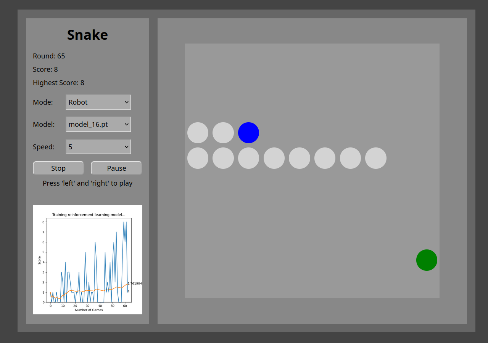

# Snake
## Description
I made the classical game, snake, with python and javascript. In the human mode, you can play the game with left and right key as you have known. In the robot mode, you can see how the reinforcement learning model learn to play the game. Or you can start with a pre-trained model.

## Usage

## Components
__HTML, CSS and JavaScript__: Frontend

__app.py__: __Flask__ is used to connect frontend and backend. __Thread__ and __Queue__ are used to keep the game running. __SocketIO__ is used to keep sending the position of the snake to the frontend

__game.py__: The game component is to control the snake, place food, control if there is a collission.

__model.py__: __PyTorch__ is used to train the reinforcement learning model by optimizing the quality of action with Bellman equation